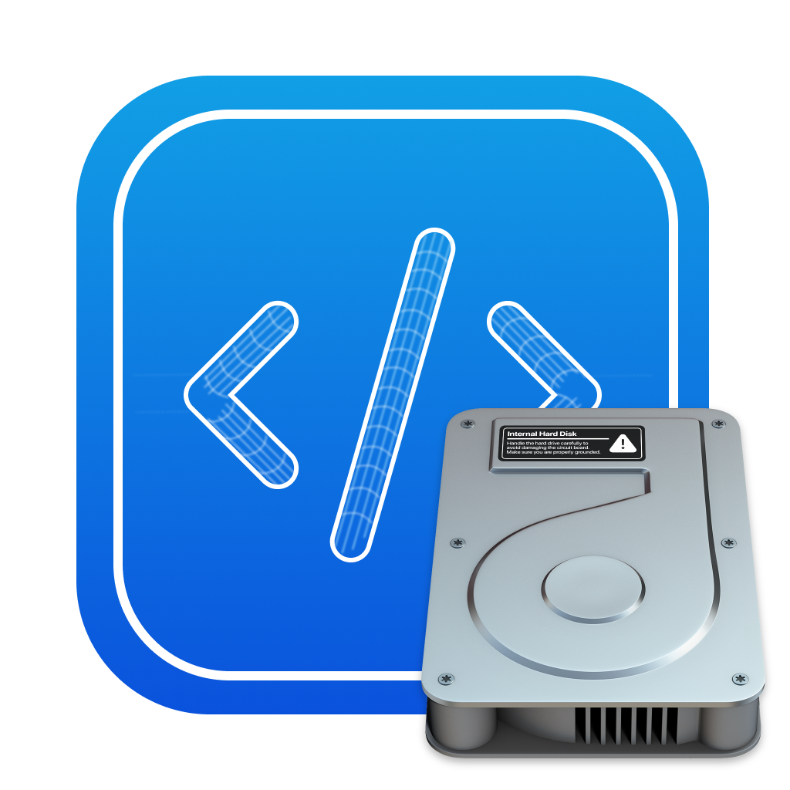

<p align="center">
  
  
  <h1 align="center">CodeMaster's Command Line Tools</h1>
</p>

<p align="center">
  <a aria-label="Follow CodeMaster on Github" href="https://github.com/CodeMasterApp" target="_blank">
    
  </a>
  <a aria-label="Read the Documentation" href="" target="_blank">
    
  </a>
  <a aria-label="Join the community on Discord" href="https://discord.gg/NgKstR2Uvh" target="_blank">
    
  </a>
</p>

The official CodeMaster installer app with a simple but powerful interface for installing CM command line tools and CodeMaster itself.


In order to run the app make sure you have homebrew installed.
Make sure to have cmake installed if not run
```sh
  brew install cmake
```

1. Navigate to the build dir
```sh
cd build
```
2. Create an executable
```sh
cmake ..
```
3. Build the executable
```sh
make
```
4. Run the app
```sh
./CMInstaller
```
